<p align="center">
  <a href="https://filamentcraft.dev">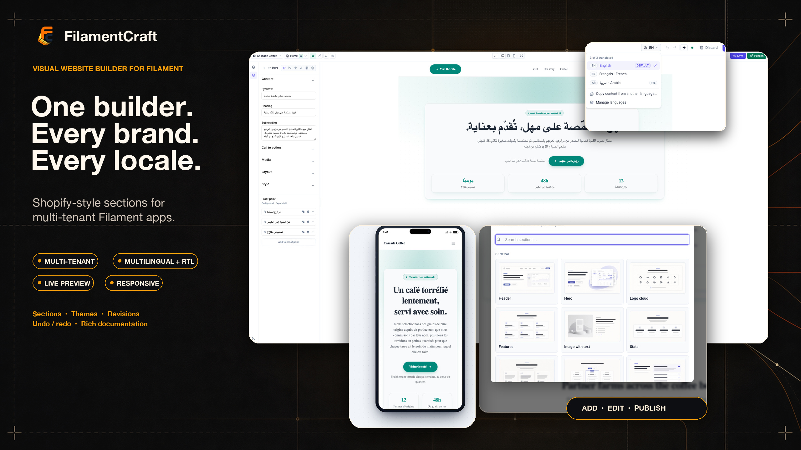</a>
</p>

<h1 align="center">FilamentCraft</h1>

<p align="center">
  A Shopify-style, drag-and-drop website builder for <a href="https://filamentphp.com">Filament</a> v4 &amp; v5.<br>
  Your users build the website. You ship the app.
</p>

<p align="center">
  <a href="https://demo.filamentcraft.dev">Live demo</a> ·
  <a href="https://filamentcraft.dev/guide/introduction">Documentation</a> ·
  <a href="https://filamentcraft.dev/#pricing">Pricing</a> ·
  <a href="https://github.com/filamentcraft/filamentcraft/blob/main/CHANGELOG.md">Changelog</a> ·
  <a href="https://github.com/filamentcraft/filamentcraft/issues">Issues &amp; support</a>
</p>

> **About this repository.** FilamentCraft is a commercial plugin. This public repository carries the documentation, changelog, screenshots and the issue tracker. The source is delivered through the private Composer registry at `packages.filamentcraft.dev` when you buy a license. Bug reports and feature requests from anyone — customer or not — are welcome in [Issues](https://github.com/filamentcraft/filamentcraft/issues).

## What it looks like

| | |
|---|---|
| 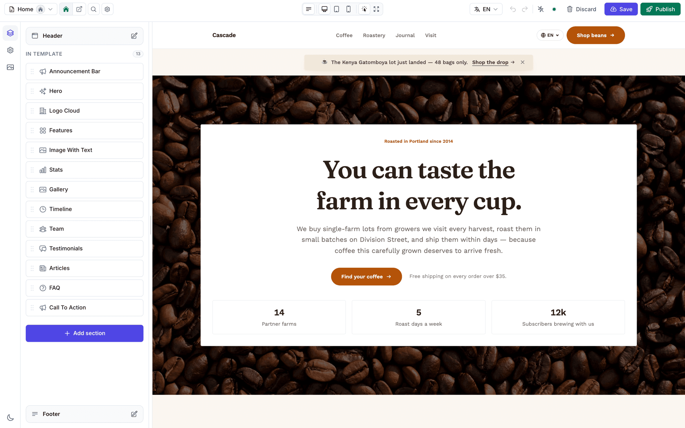 | 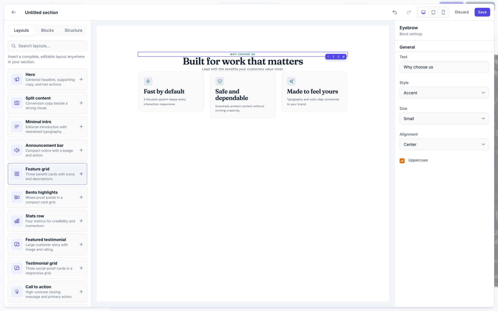 |
| 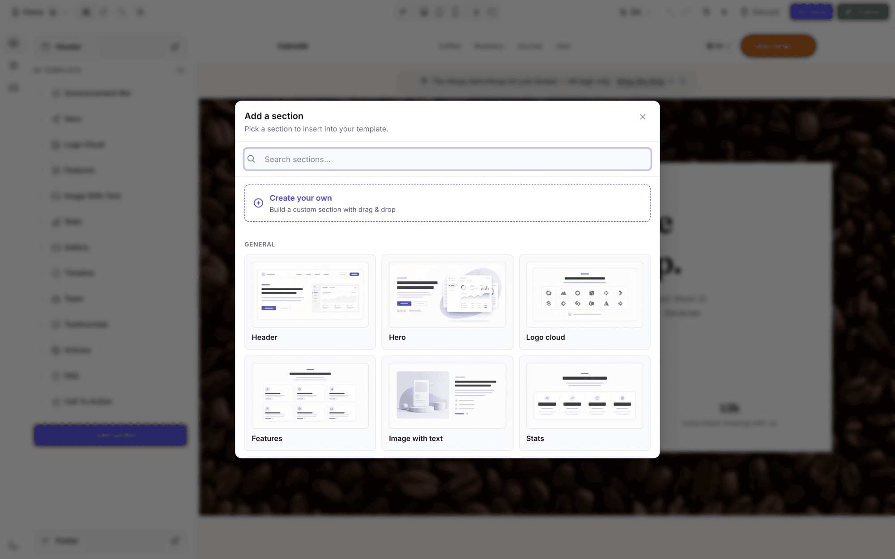 | 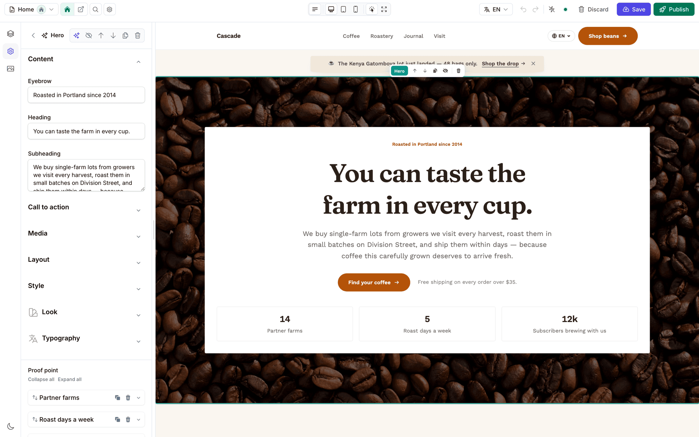 |
| 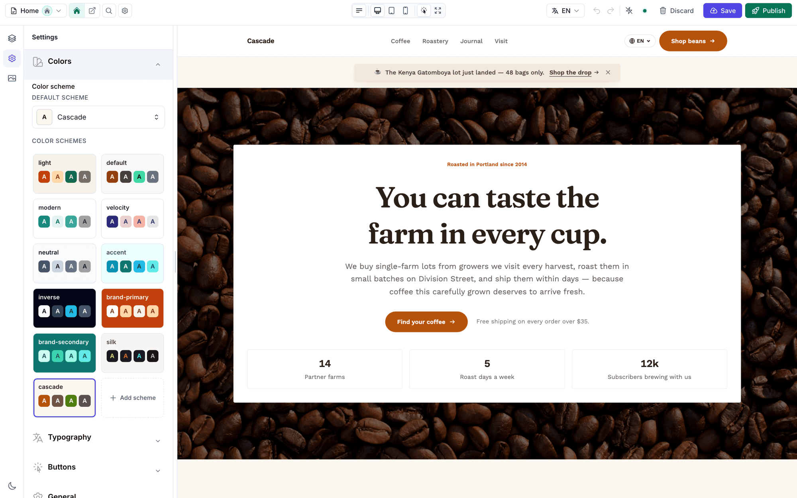 | 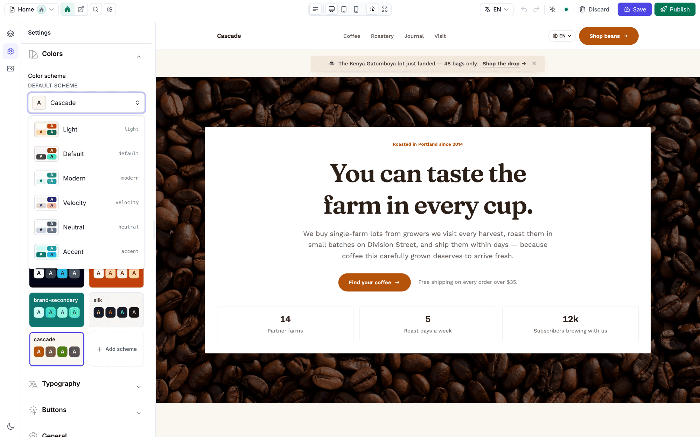 |
| 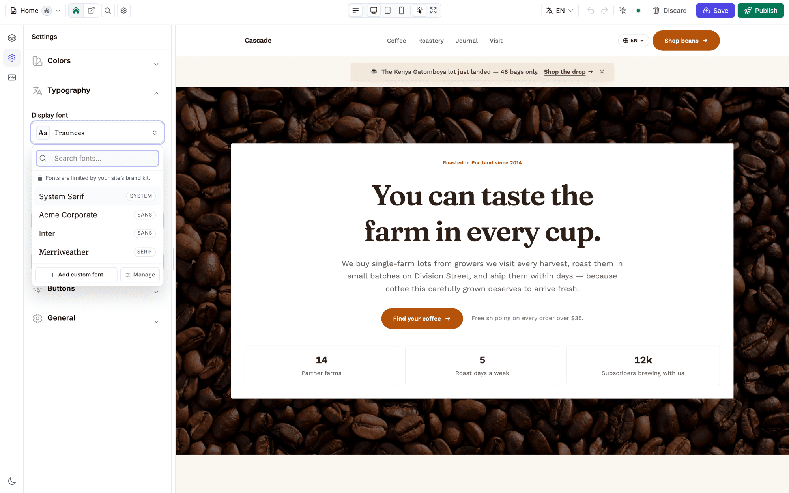 | 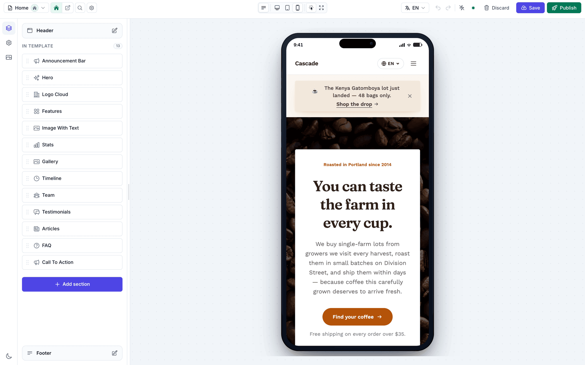 |
| 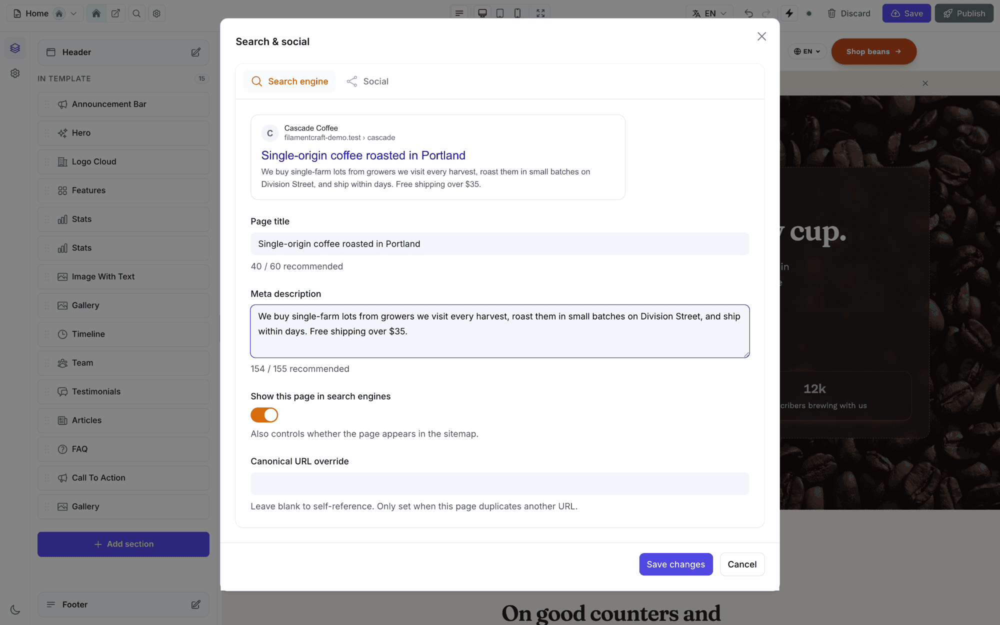 | 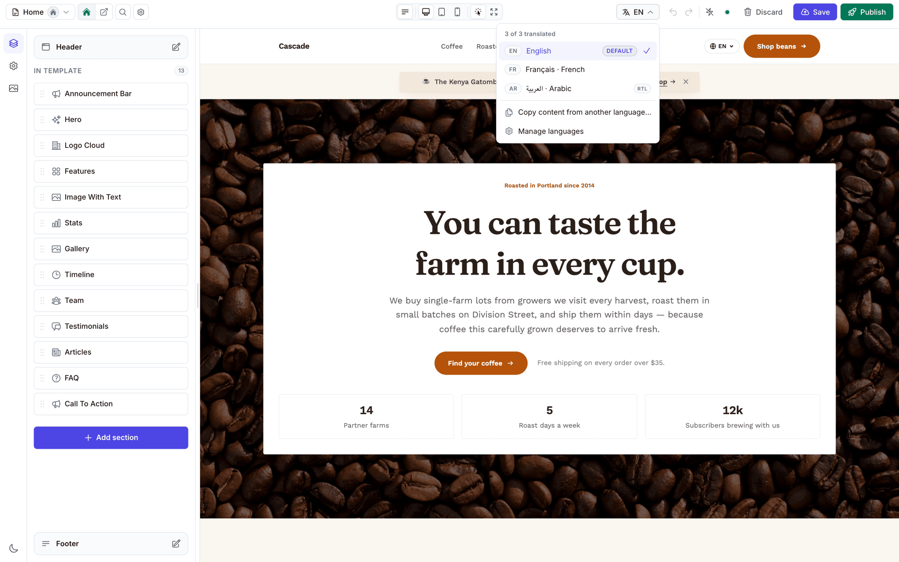 |
| 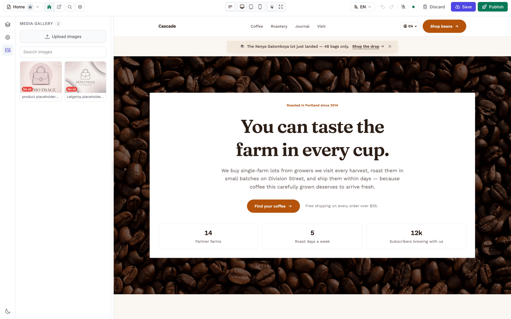 | 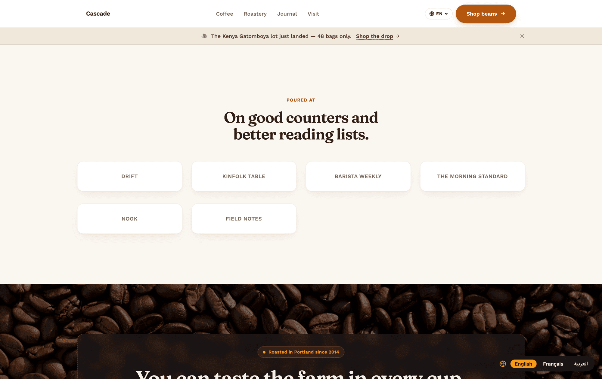 |

## Highlights

- **32 built-in sections** — marketing, content and commerce, each with one-click presets in four design families
- **No-code section builder** — your users compose new section types from 25 blocks and 24 layouts; the settings panel is generated from what they built
- **Live iframe preview** — section-level refresh from draft state, device previews, undo/redo
- **Themes your users can edit** — colors, typography, buttons, ~1,900 Bunny fonts, 22-token color schemes, brand kits
- **Multi-tenant** — sites belong to any owner model; works with stancl/tenancy, spatie/multitenancy, Filament tenancy, or single-site apps
- **Multilingual with full RTL** — every locale is its own content slice; hreflang, locale switcher
- **E-commerce sections** driven by your own tables through one `Storefront` contract
- **SEO &amp; AI search** — server-rendered, sitemap, JSON-LD, llms.txt, IndexNow, AI-crawler policy
- **Filament 4 and 5, Livewire 3 and 4** — one codebase, Composer picks the pair your app already has

---


A Shopify-style visual website builder for Filament v4 and v5. Drag-and-drop sections, live iframe preview, revisioned templates, undo/redo, multi-tenant ready.

## Requirements

- PHP 8.2+
- Laravel 11, 12, or 13
- Filament 4.x or 5.x
- Livewire 3.x or 4.x

> **Note** — FilamentCraft dual-supports Filament 4 (with Livewire 3) and Filament 5 (with Livewire 4) from one codebase. Composer will pick the right pair based on what your host app already has installed.

## Install

FilamentCraft is sold at [filamentcraft.dev](https://filamentcraft.dev) and installed from our private Composer registry. Add the repository and your credentials (username = the email you purchased with, password = your license key), then require the package:

```bash
composer config repositories.filamentcraft composer https://packages.filamentcraft.dev
composer config http-basic.packages.filamentcraft.dev your@email.com your-license-key
composer require filamentcraft/filamentcraft
php artisan filamentcraft:install
```

The install command publishes the config + migrations, runs them, registers editor assets via `filament:assets`, and creates the public storage symlink used by image uploads.

Finally, put your license key in `.env` so rendered pages skip the "Built with FilamentCraft" attribution link (see [License](#license)):

```dotenv
FILAMENTCRAFT_LICENSE_KEY=your-license-key
```

To land on a working page right after install, pass `--example`:

```bash
php artisan filamentcraft:install --example
```

That seeds a `studio` Theme, a `studio-demo` Site, and a published `home` template populated with Hero + Features + Footer sections. Re-running the command is idempotent — the second invocation prints `Example site already seeded` and exits cleanly.

Register the plugin on the panel that should host the editor:

```php
use FilamentCraft\FilamentCraftPlugin;

public function panel(Panel $panel): Panel
{
    return $panel
        ->id('admin')
        ->plugin(FilamentCraftPlugin::make());
}
```

That's it for the minimal install — open the panel and you'll find a "Templates" resource and an "Editor" page. Create a Theme + Site row first (via the resources or a seeder), then add a Template and click **Open in Editor**.

Verify the setup any time — `php artisan filamentcraft:doctor` checks migrations, theme sync, sites, published assets, and panel wiring, printing a fix-it hint under anything that fails. `php artisan about` shows the installed version, registered theme/section counts, tenancy mode, and license state at a glance.

## Upgrading

Migrations ship as stubs that `filamentcraft:install` copies into your `database/migrations/`, and the editor CSS/JS is copied into your `public/`. `composer update` refreshes neither — it only replaces `vendor/`. Run one command after every update of this package:

```bash
php artisan filamentcraft:upgrade
```

It publishes the migration stubs added since your install (existing files are never touched), runs `php artisan migrate`, re-syncs the built-in themes, and refreshes the published editor assets. Add it to your deploy script next to `php artisan migrate`.

| Flag | Effect |
|---|---|
| `--no-migrate` | Publish the new migrations but don't run them (run `php artisan migrate` yourself). |
| `--no-assets` | Skip the asset refresh. |

Skipping the upgrade is silent: the app boots and pages render against the older schema until something reaches for a column or a data normalisation that never landed. `filamentcraft:doctor` fails on both halves — it names each unpublished migration and each missing column — so a CI step of `php artisan filamentcraft:doctor --strict` catches a forgotten upgrade before your visitors do.

## Filament custom theme and Tailwind

FilamentCraft ships compiled fallback CSS so the editor and the built-in sections are usable immediately after `php artisan filamentcraft:install`. For a real project, you should still use a Filament custom theme and let the host app compile the Tailwind classes used by this package and by your own sections.

Filament's default panel stylesheet only contains Filament's own UI classes. Any Tailwind utilities used in package views, custom pages, custom section Blade files, or section PHP classes must be visible to the host app's Tailwind build.

Create a panel theme if the app does not already have one:

```bash
php artisan make:filament-theme admin
```

Make sure the generated theme is registered on the panel:

```php
use Filament\Panel;

public function panel(Panel $panel): Panel
{
    return $panel
        // ...
        ->viteTheme('resources/css/filament/admin/theme.css')
        ->plugin(FilamentCraftPlugin::make());
}
```

Then add FilamentCraft and your own section sources to `resources/css/filament/admin/theme.css`:

```css
@import '../../../../vendor/filament/filament/resources/css/theme.css';

@source '../../../../app/Filament/**/*';
@source '../../../../resources/views/filament/**/*';

/* FilamentCraft editor views, field views, and PHP classes that emit classes. */
@source '../../../../vendor/filamentcraft/filamentcraft/resources/views/**/*.blade.php';
@source '../../../../vendor/filamentcraft/filamentcraft/src/**/*.php';

/* Your host-app sections. */
@source '../../../../app/Sections/**/*.php';
@source '../../../../resources/views/sections/**/*.blade.php';

@custom-variant dark (&:where(.dark, .dark *));
```

Rebuild after changing the source list:

```bash
npm run build
php artisan filament:assets
```

This follows Filament's plugin guidance: plugin views that use Tailwind should be included in the host custom theme with `@source`. FilamentCraft keeps its compiled CSS enabled as a fallback for quick installs and for users who have not created a custom theme yet.

## What you get out of the box

- **Editor page** — left rail of section catalog + page sections, center iframe preview (desktop / tablet / mobile), right settings panel.
- **32 built-in sections** — marketing (Hero, Features, Pricing, FAQ, Testimonials, CTA, …), content (Articles, Gallery, Portfolio, Timeline, Video, …), and a data-driven commerce pack (Product listing, Cart, Checkout, …), each with one-click presets in four design families. Toggle all off with `->withBuiltinSections(false)` or hide specific section types from the catalog with `->withoutSections([...])`.
- **Live preview** — section-level refresh from the server's draft state (no full reload), debounced autosave, and a configurable undo/redo ring buffer (50 steps by default).
- **Revisions** — every Save creates a `template_revision` row; Publish promotes the head revision to the public-facing one. Discard rolls back to the published state.
- **Public routing** — opt-in catch-all that serves published templates. Off by default; flip on when you want FilamentCraft to own the front-end.
- **Multi-tenant** — sites can belong to any host model (`User`, `Workspace`, `Shop`, …) via a polymorphic `owner` morph. Resolves automatically against Filament's tenant.
- **Homepage assignment** — set any template as the site's `/` from the editor topbar (✓ shipped).

## Navigation labels

Rename the sidebar group and each navigation item from the plugin — no translation publishing required. The defaults are **Content** (group), **Website builder** (dashboard entry), **Stores**, **Pages**, and **Designs**. Each setter is optional and falls back to the bundled label (or your published `lang/vendor/filamentcraft` translation) when omitted.

```php
use FilamentCraft\FilamentCraftPlugin;

$panel->plugin(
    FilamentCraftPlugin::make()
        ->navigationGroup('Website')          // sidebar group header — default: "Content"
        ->navigationLabel('FilamentCraft')     // the dashboard entry — default: "Website builder"
        ->sitesNavigationLabel('Sites')        // Sites resource — default: "Stores"
        ->templatesNavigationLabel('Templates') // Templates resource — default: "Pages"
        ->themesNavigationLabel('Themes')       // Themes resource — default: "Designs"
);
```

Pass `null` to any setter to keep the default. For full localization across locales, publish the translations instead (`php artisan vendor:publish --tag=filamentcraft-translations`) and edit the `navigation.*` / `dashboard.navigation_label` keys.

## Custom sections

Drop a class anywhere on the autoloader, extend `BladeSection`, and FilamentCraft picks it up. Section schemas are static and can mix FilamentCraft settings with raw Filament v4 components.

```php
namespace App\Sections;

use FilamentCraft\Sections\BladeSection;
use FilamentCraft\Settings\Types\Image;
use FilamentCraft\Settings\Types\Text;
use FilamentCraft\Settings\Types\Textarea;

final class TestimonialSection extends BladeSection
{
    protected static string $view = 'sections.testimonial';

    public static function slug(): string
    {
        return 'testimonial';
    }

    public static function name(): string
    {
        return 'Testimonial';
    }

    public static function category(): string
    {
        return 'Content';
    }

    public static function settings(): array
    {
        return [
            Textarea::make('quote')->label('Quote')->required(),
            Text::make('author')->label('Author')->required(),
            Image::make('avatar')->label('Avatar'),
        ];
    }

    public static function defaults(): array
    {
        return [
            'settings' => [
                'quote' => 'A useful quote about the product.',
                'author' => 'Customer Name',
            ],
            'blocks' => [],
        ];
    }
}
```

Then in the Blade view (`resources/views/sections/testimonial.blade.php`):

```blade
<figure class="px-6 py-12 text-center">
    <blockquote class="text-2xl">{{ $section->settings->get('quote') }}</blockquote>
    <figcaption class="mt-4 text-sm text-gray-500">{{ $section->settings->get('author') }}</figcaption>
</figure>
```

Register it explicitly:

```php
use FilamentCraft\FilamentCraftPlugin;

public function panel(Panel $panel): Panel
{
    return $panel
        ->plugin(
            FilamentCraftPlugin::make()
                ->registerSection(\App\Sections\TestimonialSection::class)
        );
}
```

…or call `->discoverSectionsIn(app_path('Sections'))` on that same plugin instance. The conventional path `app/Sections/` is auto-scanned with no extra config.

### Interactive sections — `LivewireSection`

A section that needs server round-trips (a modal, a filter, an add-to-cart) extends `LivewireSection` instead of `BladeSection`. Everything else is identical — same `slug()`, `settings()`, `defaults()`, same `$section->settings` in the view — plus the component's own public properties and actions.

```php
final class PricingPlansSection extends LivewireSection
{
    protected static string $view = 'sections.pricing-plans';

    public ?string $planId = null;

    public function choose(string $id): void
    {
        $this->planId = $id;
    }
}
```

**The view must open with the root element.** A `LivewireSection` is mounted as a Livewire component, so it inherits Livewire's single-root-tag requirement: nothing may print above the first tag — no `@if`, `@foreach`, `@unless`, no HTML comment, nothing. This is the one rule that costs a day, because breaking it does not reliably throw. Blade compiles a conditional into `<!--[if BLOCK]>` marker comments, and one of those above the root leaves Livewire wiring `wire:id` to a node its morph diff never aligns against — the section renders, server-rendered clicks work, and every control inserted by a later update is inert. No console error, no failed request.

```blade
{{-- Wrong: the @if prints marker comments above the root --}}
@if ($items->isEmpty())
    @php return; @endphp
@endif
<div class="pricing-plans">…</div>

{{-- Right: a @php block emits nothing, so the condition moves onto the root --}}
@php
    $hidden = $items->isEmpty() && ! $section->designMode;
@endphp

<div class="pricing-plans" @if ($hidden) hidden @endif>…</div>
```

With `APP_DEBUG=true` FilamentCraft catches both shapes and throws naming your class and view path, instead of leaving you with Livewire's context-free `RootTagMissingFromViewException` — or with no error at all.

### Extending built-in sections

Use the guided command to search all built-ins and create a safe variant or an explicit application-wide replacement:

```bash
php artisan filamentcraft:customize-section
php artisan filamentcraft:customize-section hero ProductHero
php artisan filamentcraft:customize-section hero ApplicationHero --replace --copy-view
```

The generated subclass inherits the built-in settings, blocks, presets, defaults, and behavior. `--copy-view` takes application ownership of only the Blade markup; without it, upstream view improvements continue to apply. See [Customizing Built-in Sections](https://filamentcraft.dev/guide/customizing-built-in-sections) for the complete workflow, upgrade guidance, and rollback.

The underlying manual pattern remains simple. Give the subclass its own slug, optionally point it at a custom Blade view, and override only the settings/defaults you want to change:

```php
namespace App\Sections;

use FilamentCraft\Sections\Builtin\HeroSection;

class ProductHeroSection extends HeroSection
{
    protected static string $view = 'sections.product-hero';

    public static function slug(): string
    {
        return 'product-hero';
    }

    public static function name(): string
    {
        return 'Product hero';
    }
}
```

Register the subclass with `->registerSection(ProductHeroSection::class)`.

### Curating the catalog

Use `allowSections()` when the editor should show only a short list, and `withoutSections()` when you want the full library except a few types. These filters affect the Add Section catalog only; existing templates keep rendering registered section types.

```php
FilamentCraftPlugin::make()
    ->allowSections(['hero', 'features', 'cta'])
    ->withoutSections(['pricing']);
```

### Enum-backed visual controls

For clean visual selectors, use `EnumButtons`. The enum must be string-backed and implement Filament's `HasLabel`, `HasColor`, and `HasIcon` contracts:

```php
use FilamentCraft\Enums\Sections\SectionShape;
use FilamentCraft\Settings\Types\EnumButtons;

EnumButtons::make('shape')
    ->label('Shape')
    ->enum(SectionShape::class)
    ->default(SectionShape::Contained->value);
```

## Authoring a custom theme

A FilamentCraft **theme** is one PHP class that declares the settings panel your end-users see in the editor — Colors, Typography, Buttons, Inputs, Boxes, Social Media Links, General, Header, Floating Buttons, or anything else you want to expose. The package ships one default theme (`StudioTheme`) with a Bagisto-style 9-category panel. Custom themes coexist alongside or replace it entirely.

### 1. Create the theme class

Place it in `app/Themes/AcmeTheme.php`:

```php
<?php

namespace App\Themes;

use FilamentCraft\Settings\Types\Category;
use FilamentCraft\Settings\Types\Checkbox;
use FilamentCraft\Settings\Types\ColorSchemeGroup;
use FilamentCraft\Settings\Types\Font;
use FilamentCraft\Settings\Types\Group;
use FilamentCraft\Settings\Types\Range;
use FilamentCraft\Settings\Types\Select;
use FilamentCraft\Theming\AbstractTheme;

final class AcmeTheme extends AbstractTheme
{
    public function slug(): string
    {
        return 'acme';
    }

    public function name(): string
    {
        return 'Acme';
    }

    public function settingsSchema(): array
    {
        return [
            Category::make('colors')
                ->label('Colors')
                ->icon('heroicon-o-swatch')
                ->collapsed(false) // open by default; categories are collapsed otherwise
                ->settings([
                    ColorSchemeGroup::make('color_scheme')->default('light'),
                ]),

            Category::make('typography')
                ->label('Typography')
                ->icon('heroicon-o-language')
                ->settings([
                    Font::make('default_font')->cssVar('--font-default')->default('inter'),
                    Font::make('heading_font')
                        ->cssVar('--font-heading')
                        ->onlyCategory(['display', 'serif']) // restrict the picker
                        ->default('playfair-display'),
                    Range::make('body_size')
                        ->cssVar('--font-body-size', 'px')
                        ->unit('px')->min(12)->max(20)->default(16),
                ]),

            Category::make('buttons')
                ->label('Buttons')
                ->icon('heroicon-o-cursor-arrow-rays')
                ->settings([
                    Range::make('button_radius')
                        ->cssVar('--button-radius', 'px')
                        ->unit('px')->min(0)->max(24)->default(8),
                    Checkbox::make('button_uppercase')
                        ->cssVar('--button-text-transform')
                        ->cssValues('uppercase', 'none') // boolean -> CSS string
                        ->default(false),
                ]),
        ];
    }
}
```

### 2. Register it

Two equivalent ways. Pick whichever fits your setup:

**A. Via `config/filamentcraft.php`** (recommended — works for panel routes _and_ public preview/site routes):

```php
'themes' => [
    'paths' => [],
    'builtin_enabled' => true,    // ship StudioTheme alongside; set false to replace it
    'register' => [
        \App\Themes\AcmeTheme::class,
    ],
],
```

**B. Via the plugin's fluent API** (panel-only — for themes that should _only_ render inside Filament admin, not on public pages):

```php
use FilamentCraft\FilamentCraftPlugin;

public function panel(Panel $panel): Panel
{
    return $panel
        ->plugin(
            FilamentCraftPlugin::make()
                ->registerTheme(\App\Themes\AcmeTheme::class)
                ->withoutBuiltinThemes() // optional — drop StudioTheme so only Acme appears
        );
}
```

Then create a `Theme` Eloquent row whose `slug` matches (`'acme'`) and assign your `Site` to it.

### 3. Use the variables in your theme CSS

Every `cssVar()` declaration is emitted into `<style id="fc-tokens">` on `:root` of the rendered iframe / public page:

```css
.btn {
  border-radius: var(--button-radius);
  text-transform: var(--button-text-transform);
  font-size: var(--font-body-size);
  font-family: var(--font-default);
}
```

If you use Tailwind v4, map them into utility classes via `@theme inline` so `bg-primary` / `text-on-primary` etc. work in your section blades:

```css
@theme inline {
  --font-default: var(--font-default);
  --font-heading: var(--font-heading);
  --color-primary: var(--color-primary);
  --color-primary-50: var(--color-primary-50);
  --color-primary-500: var(--color-primary-500);
  --color-primary-900: var(--color-primary-900);
}
```

`ColorSchemeGroup` automatically emits the Tailwind-style 11-step OkLch shades (`--color-primary-50…950`) for every non-`on-*` token of the active scheme — `bg-primary-600` and `hover:bg-primary-700` work natively, no extra config.

### 4. Setting types reference

| Setting | Filament rendering | What `cssVar()` emits |
|---|---|---|
| `Text`, `Textarea` | `<input>`, `<textarea>` | the string value |
| `Number`, `Range` | numeric `<input>` | number + unit (`12px`, `0.05em`) |
| `Color` | Filament color picker | hex (`#ff0000`) |
| `Font` | **Bagisto-style searchable picker** with live previews from Bunny Fonts (~1,900 families) | full CSS font-family stack (e.g. `"Inter", ui-sans-serif, sans-serif`) |
| `Select`, `Radio` | dropdown / radio group | the selected option's value |
| `Checkbox` | toggle | `cssOnValue` / `cssOffValue` (e.g. `'uppercase'` / `'none'`) |
| `ColorSchemeGroup` | tile grid + drill-in 22-token editor + "Add scheme" | full scheme tokens + auto OkLch shades |
| `Image`, `Icon`, `Link`, `RichText` | Filament built-ins | n/a — read in section Blade via `$site->settings_json['my_setting']` |
| `Group` | collapsible sub-section inside a section's settings | n/a — purely visual grouping |
| `Category` | top-level collapsible section in the template-settings panel | n/a — purely visual grouping; **closed by default**, pass `->collapsed(false)` to open |

### 5. Font picker (Bunny Fonts)

`Font::make('default_font')` renders a Bagisto-faithful picker that's much more than a `<select>`:

- **Live catalog from `https://fonts.bunny.net/list`** — ~1,948 families, fetched once and cached server-side for 24h
- **Popular tab pinned first** — Inter, Roboto, Open Sans, Lato, Poppins, Manrope, DM Sans, Merriweather, Playfair Display, JetBrains Mono, etc., ahead of the alphabetical roster
- **Per-row preview in the option's own font** — lazy-loaded via IntersectionObserver as you scroll
- **Eager-load** the active font + the top 25 popular fonts on mount so opening the popover is instant
- **Searchable** with debounced 150ms input
- **Category chips**: Popular · All · System · Sans · Serif · Display · Mono · Handwriting
- **Keyboard nav**: arrow up/down to highlight, Enter to commit, Escape to close
- **Live preview**: pick a font → setting persists → iframe head re-syncs (Bunny `<link>` injected, `<style id="fc-tokens">` updated, body inherits) within ~1.5s

Constrain the picker to specific categories with `->onlyCategory()`:

```php
Font::make('heading_font')
    ->cssVar('--font-heading')
    ->onlyCategory(['display', 'serif']); // hides sans/mono/handwriting from the picker
```

The picker stores the slug (e.g. `'inter'`, `'merriweather'`, `'system-sans'`). At render time `Font::resolveFamily($slug)` expands it to the full CSS stack via the cached `FontCatalog`. Free-form values pass through unchanged, so a theme author can ship `Font::make('brand')->default('"Acme Sans", sans-serif')` and it works without ever hitting Bunny.

The relevant config / extension points:

- `config('filamentcraft.themes.builtin_enabled')` — toggle whether `StudioTheme` registers
- `config('filamentcraft.themes.register')` — array of FQCNs to add
- `\FilamentCraft\Support\FontCatalog` — service singleton; bind your own implementation to swap data source (e.g. self-host the catalog)
- `FontCatalog::flush()` — clear the 24h cache when you want a fresh fetch

### 6. Color schemes (`ColorSchemeGroup`)

`ColorSchemeGroup::make('color_scheme')` renders a 2-column grid of scheme tiles plus an "Add scheme" affordance. Click a tile to drill into the 22-token editor (Background, On Background, Surface, On Surface, Surface Alt, On Surface-Alt, Primary, On Primary, Secondary, On Secondary, Accent, On Accent, Neutral, On Neutral, Info, On Info, Success, On Success, Warning, On Warning, Danger, On Danger).

The 14 package-shipped schemes (`light`, `dark`, `default`, `modern`, `velocity`, `neutral`, `accent`, `inverse`, `brand-primary`, `brand-secondary`, `cupcake`, `lofi`, `nord`, `silk`) are always available. End-users can add their own — they're persisted on `Site.settings_json['schemes']` so each site keeps its overrides without mutating the shared `Theme`.

Sections can override the active scheme per-block:

```blade
<div {!! $section->colorScheme()->attributes() !!} class="bg-background text-on-background">
  <h2 class="text-on-surface">…</h2>
</div>
```

### 7. Live-update modes

The `SchemaCompiler` routes every field through one of two Livewire live modes:

- **Instant `live()`** — Checkbox, Radio, Select, Font, Icon, ColorScheme, ColorSchemeGroup. Discrete events (one click = one value), so the round-trip fires immediately on each change.
- **Lazy `live(onBlur: true)`** — Text, Textarea, Number, Range, Link, Image, RichText, Color. Typing/dragging/uploading inputs (and the color picker, which fires continuously while dragging) defer the round-trip until blur so a half-typed value never triggers a Livewire morph mid-keystroke (which would crash the TipTap rich-editor's bubble menu).

You don't configure this — it's automatic per setting type.

### 8. Persistence

- The active **color scheme slug** is stored on the template draft (so different templates can use different schemes).
- **User-authored color schemes** (Add scheme + 22 tokens) live on `Site.settings_json['schemes']`, separate from the package-shipped 14 built-ins.
- **Every other setting value** goes onto `Site.settings_json` keyed by setting id. Diff-only writes mean unset values inherit their schema-declared defaults — package upgrades to those defaults flow through automatically.

Helpers if you want to read/write programmatically (migrations, seeds, API endpoints):

```php
use FilamentCraft\Support\SiteThemeSettings;
use FilamentCraft\Support\SiteColorSchemes;

// Read merged values (overrides + schema defaults).
$values = SiteThemeSettings::values($site, $site->theme->templateSettings());

// Write a partial set (diffs against defaults; values matching default aren't stamped).
SiteThemeSettings::sync($site, $schema, ['button_radius' => 12]);

// Color-scheme overrides (per-site authored map).
$schemes = SiteColorSchemes::forSite($site);                 // 14 built-ins + overrides
SiteColorSchemes::add($site, cloneFrom: 'cupcake');           // returns "scheme-N"
SiteColorSchemes::remove($site, 'scheme-13');
```

### 9. Live preview architecture

Editing any setting in the editor patches the iframe live:

| Change | What the iframe does |
|---|---|
| Active color scheme slug only | Flips `data-fc-color-scheme` on `<html>` instantly (no server round-trip — the schemes are pre-rendered into `<style id="fc-tokens">`). |
| Authored color tokens, font slug, range/checkbox/etc. | Templates a server `templateRefresh` (single GET, ~150ms), then the iframe morphs `<body>` and **also syncs `<head>`**: `<style id="fc-tokens">` text is replaced, stale Bunny `<link>` tags are pruned, fresh ones are added. No flash, no FOUC for cached fonts. |
| Section settings (Hero heading text, etc.) | Either patched in-place via the LivePatcher (any element with `data-fc-live="…"` gets surgical updates) or section-level refresh, depending on the field shape. |

The renderer auto-injects `<link rel="stylesheet" href="https://fonts.bunny.net/css?family={slug}:400,500,600,700&display=swap">` for every Font setting whose value resolves to a remote family. System stacks (`system-sans`, `system-serif`, `system-mono`) emit no link because they resolve entirely to platform fonts.

### 10. Reference

- **Canonical theme**: [`src/Theming/Themes/StudioTheme.php`](src/Theming/Themes/StudioTheme.php) — the 9-category default panel, fully wired up.
- **Theme contract**: `FilamentCraft\Theming\ThemeContract` (extend `AbstractTheme` for sensible defaults).
- **Setting base**: `FilamentCraft\Settings\Setting` — `cssVar(string $name, ?string $unit = null)`, `default()`, `label()`, `info()`, `required()`, `visibleIf([...])`.
- **Filament fields used by the picker UI**: `FontPickerField`, `ColorSchemeGroupField`, `ColorSchemePicker`, `ColorSchemeTokensField`, `IconPicker` — all in `src/Filament/Forms/Components/`.

## Tenancy

| Mode | What it does |
|---|---|
| `auto` (default) | Filament tenant if available, then config single-site, then owner-mode fallback. |
| `none` | Single-site mode — resolves `tenancy.single_site_id` when set, otherwise the first live site. |
| `filament` | Resolves the active Site by matching its `owner_id`/`owner_type` against `Filament::getTenant()`. |
| `owner` | Same, but bound to a specific `owner_model` you pass below. |

Single-app / non-tenant setup:

```php
use FilamentCraft\FilamentCraftPlugin;

public function panel(Panel $panel): Panel
{
    return $panel
        ->plugin(
            FilamentCraftPlugin::make()
                ->singleSite()
        );
}
```

If you already know the site id and want to pin resolution to it:

```php
FilamentCraftPlugin::make()
    ->singleSite(1);
```

Multi-tenant setup:

```php
use App\Models\Workspace;
use FilamentCraft\FilamentCraftPlugin;

public function panel(Panel $panel): Panel
{
    return $panel
        ->plugin(
            FilamentCraftPlugin::make()
                ->tenantSites(Workspace::class)
        );
}
```

`tenantSites()` configures the Filament panel tenant, FilamentCraft tenant resolution, and live-page URL generation together. It assumes your tenant URL uses a `slug` column and the package route helper below.

When a tenant owns exactly one site — the common shape for `tenantSites()`, since a second site under the same tenant has no URL that reaches it — withhold site creation:

```php
FilamentCraftPlugin::make()
    ->tenantSites(Workspace::class)
    ->allowSiteCreation(false);
```

`allowSiteCreation()` also takes a closure, so a platform admin can still create sites while tenants cannot:

```php
->allowSiteCreation(fn (?Authenticatable $user): bool => $user?->isPlatformAdmin() ?? false);
```

The gate closes the editor's "New store" action (including a hand-mounted one), the dashboard's create-site header action, and `SiteResource`'s create page together — not just the buttons.

When the host owns URL generation — `publicUrlsViaNamedRoute()` with `filamentcraft.public_routes` off — the site's **Custom domain** and **Subdomain** fields are read by nothing, so they hide themselves and the slug field drops its domain-fallback helper text. Bring them back with `->siteRoutingFields()` if your app applies the `SiteContext` middleware to routes it owns.

The plugin never `require`s a tenancy package — it works with stancl/tenancy, spatie/laravel-multitenancy, Filament-only setups, or single-site apps without modification.

## Public routing

Off by default — most hosts already own their front-end and only want the editor. Flip on with:

```php
// config/filamentcraft.php
'public_routes' => true,
```

This registers a catch-all `GET /{path?}` that resolves the host (via `Site::domain` / `subdomain`) and renders the matching template's published revision. The homepage assignment in the editor topbar drives `/`. Slugs like `/pricing` resolve to the published template with that slug.

If you want a tenant URL scheme — `/{tenant}/{slug}` — keep `public_routes => false` and add one route:

```php
use App\Models\Workspace;
use Illuminate\Support\Facades\Route;

Route::filamentCraftTenant(Workspace::class);
```

That registers `GET /{tenantSlug}/{path?}`, resolves the `Workspace` by `slug`, binds the workspace's live FilamentCraft site, and renders the published page. The default route name is `filamentcraft.tenant.public`.

Use named arguments only when your app differs from the defaults:

```php
Route::filamentCraftTenant(
    ownerModel: Workspace::class,
    tenantParameter: 'workspace',
    tenantSlugColumn: 'domain_slug',
    name: 'tenant.public',
);
```

For completely custom URL schemes — `/shop/{tenant}/{slug}`, locale prefixes, channel paths, etc. — register your own route calling `PublicSiteController::class`.

### Custom URL strategy — `publicUrlsViaNamedRoute()`

Hosts that own their routing (multi-tenant slugs, locale prefixes, channel paths) tell FilamentCraft how to build the public URL of a `Template`. This drives the editor topbar's "open live" pill, the URL bar, and the **View live** action on the Templates list — every place that asks "where does this page live?".

For the 90% case — a named Laravel route with a path parameter and an optional tenant parameter — use the declarative helper:

```php
use FilamentCraft\FilamentCraftPlugin;

// Single-tenant: route('page.show', ['path' => $template->slug])
$plugin = FilamentCraftPlugin::make()
    ->publicUrlsViaNamedRoute('page.show');

// Multi-tenant with Route::filamentCraftTenant(...):
$plugin = FilamentCraftPlugin::make()
    ->publicUrlsViaNamedRoute(
        'filamentcraft.tenant.public',
        tenantParameter: 'tenantSlug',
    );

// Locale-prefixed extras
$plugin = FilamentCraftPlugin::make()
    ->publicUrlsViaNamedRoute(
        'tenant.public',
        tenantParameter: 'tenantSlug',
        extraParameters: [
            'locale' => fn (\FilamentCraft\Models\Template $t) => $t->site?->default_locale,
        ],
    );
```

Pass the configured `$plugin` to `$panel->plugin($plugin)` in your panel provider; do not create a separate throwaway plugin instance.

Parameters: `pathParameter` (defaults to `'path'`), `tenantParameter` (the route placeholder for the owner slug — `null` for single-tenant), `tenantSlugColumn` (the attribute on `Site::owner` holding the slug, defaults to `'slug'`), `homepagePath` (the literal value for the homepage — `''` by default; set to `'home'` etc. if your route demands it), and `extraParameters` (scalar literals or closures resolved against the template at call time).

The result is **memoised per-request** on the `Template` instance, so the editor topbar, the templates list, the sitemap, and `<og:url>` tags all hit the resolver once — not once per call. The cache is cleared automatically on `save()` / `refresh()` so a status flip or slug rename invalidates it.

#### Or a raw closure — `publicUrlUsing()`

For exotic schemes (channel paths, custom domains per template, on-the-fly redirects), drop down to the closure form:

```php
use FilamentCraft\Models\Template;

$plugin = FilamentCraftPlugin::make()
    ->publicUrlUsing(function (Template $template): ?string {
        $owner = $template->site?->owner;

        if (! $owner instanceof \App\Models\Team) {
            return null; // fall through to default resolver
        }

        return route('tenant.public', [
            'tenantSlug' => $owner->slug,
            'path' => $template->isHomepage() ? '' : $template->slug,
        ]);
    });
```

Return `null` from either form to fall through to the default behaviour (catch-all route when `public_routes` is on, otherwise the auth'd preview URL). Partial overrides — "only when the site has an owner", "only when the locale is set" — degrade gracefully.

### Linking to FilamentCraft pages from your own forms — `TemplateUrlPicker`

Need to let an admin pick a published page from a CTA button, a banner link, a footer menu item, or any other "open this page" field? Drop the picker into any Filament schema:

```php
use FilamentCraft\Filament\Forms\Components\TemplateUrlPicker;

TemplateUrlPicker::make('cta_url')
    ->label('Destination page')
    ->required();
```

**Where do the options come from?** The picker queries `Template::query()->published()` — every template whose `status === Published` and whose `publicUrl()` resolves to a non-empty string. The URL itself is whatever your `publicUrlsViaNamedRoute()` / `publicUrlUsing()` resolver returns (or the default catch-all / preview URL when no resolver is wired). Drafts are excluded — they have no public URL by design.

Defaults: options preload on open (no typing required), searchable filter by template name, scoped to the active Filament tenant, stores the resolved URL string so existing `<a href>` rendering keeps working without extra resolution code.

Configurable:

```php
TemplateUrlPicker::make('cta_url')
    ->forSite($site->id)   // pin to a specific site, ignoring the active tenant
    ->forAllSites()        // list templates across every site (admin tools)
    ->searchLimit(20);     // cap the dropdown size (defaults to 50)
```

## Custom dynamic pages

FilamentCraft templates are perfect for marketing pages, but every real
storefront also has pages that are too dynamic to live in a visual builder:
**cart, checkout, account, lesson player, search results, blog comments,
gated downloads** — anything driven by user state or per-request data.

Those pages aren't FilamentCraft templates, but they still need to look like
part of the academy / tenant's site. FilamentCraft ships **four doors** —
all backed by the same shell renderer — so you reach for the Laravel idiom
you already use:

| Adopter style | The door |
|---|---|
| **Livewire-first** | `#[Storefront]` attribute on the component class (1 line). |
| **Route-driven** | `Route::filamentCraftStorefront(Academy::class, fn () => …)` macro. |
| **File-based (Folio)** | Drop a `.blade.php` in `resources/views/storefront/`. |
| **Explicit / one-off** | `<x-filamentcraft::layout>` Blade component. |

All four render the same theme tokens + header region + footer region + fonts
+ stylesheets + `lang`/`dir`/`data-fc-color-scheme`. Pick one and never
think about the others.

### Door 1 — Livewire `#[Storefront]` attribute (recommended)

For any Livewire full-page component, one attribute is the whole
integration. The Site is auto-resolved from the URL's tenant slug or the
container — no middleware on the route required:

```php
use FilamentCraft\Attributes\Storefront;
use Livewire\Component;

#[Storefront]
final class CartPage extends Component
{
    public function render(): View
    {
        return view('livewire.cart');
    }
}
```

```php
// routes/web.php — note: no middleware, no group, no layout wrapper.
Route::get('/{academySlug}/cart', CartPage::class);
```

That's it. `<x-filamentcraft::layout>` does all the work under the hood;
`#[Storefront]` is a self-documenting alias for the standard
`#[Layout('filamentcraft::layout')]`. Anything you can do with Livewire's
own `#[Layout]` — pass data, target different layouts per method — works
identically with `#[Storefront]`.

> If you prefer staying with the Livewire-native attribute, write
> `#[Layout('filamentcraft::layout')]` instead. Same behaviour, two more
> tokens of code.

### Door 2 — `Route::filamentCraftStorefront()` route macro

For traditional Laravel controllers / Blade pages / Livewire components
without `#[Storefront]`, register a whole storefront group in one line.
Tenancy + URL prefix + middleware are wired for you, the Site is bound to
the container before each handler runs:

```php
// routes/web.php — register BEFORE Route::filamentCraftTenant(...)
Route::filamentCraftStorefront(\App\Models\Academy::class, function (): void {
    Route::get('cart',     CartPage::class);
    Route::get('checkout', CheckoutPage::class);
    Route::get('account',  AccountPage::class);
    Route::get('courses/{course}/lessons/{lesson}', LessonPlayer::class);
});
```

With `filamentcraft.tenancy.owner_model` in config, even the first
argument is optional:

```php
Route::filamentCraftStorefront(routes: function (): void {
    Route::get('cart', CartPage::class);
});
```

### Door 3 — Folio file-based routing (zero PHP)

For adopters using [Laravel Folio](https://laravel.com/docs/12.x/folio):
opt in once and any `.blade.php` file under `resources/views/storefront/`
becomes a routed page wrapped in the shell.

```bash
composer require laravel/folio
php artisan filamentcraft:install --folio
```

Now drop files:

```
resources/views/storefront/
  cart.blade.php           → /{academySlug}/cart
  checkout.blade.php       → /{academySlug}/checkout
  account/index.blade.php  → /{academySlug}/account
```

Each file wraps in `<x-filamentcraft::layout>` (the `--folio` flag
generates a starter `cart.blade.php` you can copy). Zero PHP boilerplate
per page.

### Door 4 — `<x-filamentcraft::layout>` Blade component

The escape hatch when none of the above fits — for example, a controller
that needs to swap layouts based on some runtime check, or a one-off
page in an admin panel:

```blade
{{-- resources/views/cart.blade.php in the host app --}}
<x-filamentcraft::layout :title="'Your cart — '.$site->name">
    <div class="container py-12">
        <h1 class="fc-h1">Your cart</h1>

        @livewire('cart-items')
    </div>
</x-filamentcraft::layout>
```

This is what Doors 1, 2, and 3 use under the hood. All it provides over
the others is **explicitness** — useful when you want the dependency
visible at the top of the file.

The component wraps any content you give it in the same shell the
FilamentCraft renderer uses for built templates:

- The site's theme tokens (CSS variables for colors, fonts, spacing)
- The site's **header region** (whatever sections the owner placed there)
- The site's **footer region**
- All registered stylesheets, fonts (Bunny preconnect included), scripts
- Correct `lang`, `dir` (RTL), and `data-fc-color-scheme` on `<html>`

```blade
{{-- resources/views/cart.blade.php in the host app --}}
<x-filamentcraft::layout :title="'Your cart — '.$site->name">
    <div class="container py-12">
        <h1 class="fc-h1">Your cart</h1>

        @livewire('cart-items')
    </div>
</x-filamentcraft::layout>
```

That's the full integration. The user's cart now matches the academy's
branding without you writing a layout, asset pipeline, or theme-token
mirror.

### Props

| Prop | Type | Default | Notes |
|---|---|---|---|
| `:site` | `Site` | `app(Site::class)` → `TenancyResolver` | The site whose theme + regions to render. Auto-resolved from the container when you use one of the middlewares below. |
| `:title` | `?string` | `$site->name` | Sets `<title>`. |
| `:color-scheme` | `string` | `'light'` | Mirrors a template-level color scheme. |
| `:mode` | `string` | `'published'` | `'published'` reads live region data; `'draft'` reads in-progress edits (rare outside the editor preview). |
| `:locale` | `?string` | `$site->default_locale` | Forces a locale; otherwise inherits the site default. |

### Resolving the Site automatically

For tenant-prefixed public routes (`/{academySlug}/cart`, `…/checkout`,
`…/account`, etc.), the package ships a one-line middleware that resolves
the tenant from the URL, finds its live Site, and binds it to the
container — so `<x-filamentcraft::layout>` works without any explicit
`:site` prop downstream:

```php
// routes/web.php — register BEFORE Route::filamentCraftTenant(...) so these
// concrete paths win over the storefront wildcard.
Route::middleware(['web', 'filamentcraft.tenant:academySlug,App\\Models\\Academy,slug'])
    ->prefix('{academySlug}')
    ->group(function (): void {
        Route::get('cart',     CartPage::class);
        Route::get('checkout', CheckoutPage::class);
        Route::get('account',  AccountPage::class);
        Route::get('courses/{course}/lessons/{lesson}', LessonPlayer::class);
    });
```

The three middleware arguments (`parameter,ownerModel,slugColumn`) are
optional. With `filamentcraft.tenancy.owner_model` set in config, this
becomes:

```php
Route::middleware(['web', 'filamentcraft.tenant'])
    ->prefix('{tenantSlug}')
    ->group(function (): void { /* ... */ });
```

For host-rendered routes (not tenanted), the existing
`'filamentcraft.site'` middleware (or any of your own that binds a `Site`
to the container) is also picked up automatically.

### Renaming the component

`<x-filamentcraft::layout>` is the canonical name. Hosts that want
something more domain-specific just alias it in their service provider
— **the package ships one class, the host picks the name**:

```php
// app/Providers/AppServiceProvider.php
use FilamentCraft\View\Components\Layout as FilamentCraftLayout;
use Illuminate\Support\Facades\Blade;

public function boot(): void
{
    Blade::component('academy-shell', FilamentCraftLayout::class);
}
```

Then everywhere in your views you write:

```blade
<x-academy-shell>
    @livewire('cart-items')
</x-academy-shell>
```

Pick whatever reads best for your team — `storefront`, `site-frame`,
`mediano-page`, etc. The component class is the same; the tag is yours.

## Preview and public-page assets

The Filament panel theme styles the editor chrome. The iframe preview and public template output are separate HTML documents, so they also need CSS.

**Tier 0 — package fallback (default).** `php artisan filamentcraft:install` copies the package's compiled section bundle to `public/css/...`. Built-in sections render correctly out of the box, even before the host has a custom front-end build.

**Tier 1 — mirror the admin panel into the iframe.** If your Filament panel theme also contains your site/section utilities, copy those `<link>` and `<style>` tags into the iframe at runtime:

```php
$plugin = FilamentCraftPlugin::make()
    ->mirrorEditorStyles();
```

This is useful while editing because the iframe inherits the same compiled theme as the panel. It only affects authenticated preview rendering; public pages still need their own stylesheet.

**Tier 2 — register the host site's Vite build.** Production hosts should register the CSS/JS that visitors will receive:

```php
$plugin = FilamentCraftPlugin::make()
    ->viteManifest(public_path('build/manifest.json'), [
        'resources/css/site.css',
        'resources/js/site.ts',
    ]);
```

Or for theme-style builds under a sub-directory:

```php
$plugin = FilamentCraftPlugin::make()
    ->viteBuild('themes/shop/debut/editor');
```

Pass the configured `$plugin` to `$panel->plugin($plugin)`. You can also register URLs directly with `->stylesheet('https://…/theme.css')` / `->script('…/site.js')` or via `config('filamentcraft.assets.extra_styles')` / `extra_scripts`.

If your site build fully owns the section styling, disable the package fallback:

```php
'assets' => [
    'site_css_enabled' => false,
],
```

## Editor topbar

- **Page / Site dropdowns** — switch templates of the current site, or jump to a sibling site (multi-locale setups).
- **URL pill** — shows the live URL of the current page, click-through opens it in a new tab. The home icon on the left toggles "set as homepage."
- **Device switcher** — desktop / tablet / mobile widths.
- **Focus mode** — collapses both rails to maximize the canvas.
- **Save / Publish / Discard** — Save writes a draft revision; Publish promotes it to public; Discard rolls back to the published state.
- **Undo / Redo** — 50-step ring buffer per template, persisted across reloads so a refresh doesn't lose your last 10 minutes.

## Icons

Icon settings (`Icon::make('icon')`) store the fully-qualified blade-icons name (e.g. `heroicon-m-check-badge`). Render them in any Blade view with the bundled component:

```blade
<x-filamentcraft::icon :name="$block->settings->get('icon')" class="h-6 w-6" />
```

The component renders nothing when the name is empty, missing, or invalid — no exceptions, no broken markup. Pass any `class` / attribute through to the `<svg>`:

```blade
<x-filamentcraft::icon
    :name="$section->settings->get('cta_icon')"
    class="h-5 w-5 text-primary"
    stroke-width="1.5"
/>
```

A `fallback` prop lets you pin a default for empty values:

```blade
<x-filamentcraft::icon :name="$icon" fallback="heroicon-o-sparkles" class="h-6 w-6" />
```

### Picking which sets to expose

By default, every set registered with `blade-icons` (Heroicons, Phosphor, Bootstrap, Material, …) is available in the picker. Restrict per-field with the raw Filament component:

```php
use FilamentCraft\Filament\Forms\Components\IconPicker;

IconPicker::make('icon')
    ->sets(['heroicons', 'phosphor-bold'])  // only these sets
    ->styles(['outline', 'solid'])          // heroicons sub-styles
    ->gridColumns(10);                      // grid density (4–12)
```

Or via the DSL setting (single-set only):

```php
use FilamentCraft\Settings\Types\Icon;

Icon::make('cta_icon')->set('phosphor-bold');
```

To register a new icon set globally, follow the standard [blade-icons](https://github.com/blade-ui-kit/blade-icons#defining-sets) instructions — the picker discovers them automatically.

## Image uploads

Built-in sections that accept images (Hero `bg_image`, Features icons, etc.) write to the `public` disk under `filamentcraft/uploads/` by default. Override with environment variables:

```dotenv
FILAMENTCRAFT_UPLOADS_DISK=s3
FILAMENTCRAFT_UPLOADS_DIR=tenants/acme/site
FILAMENTCRAFT_UPLOADS_VISIBILITY=public
FILAMENTCRAFT_UPLOADS_MAX_KB=20480
```

The disk MUST be publicly readable so the renderer's `Storage::disk()->url($path)` call resolves to a working URL.

## Cache

Rendered sections are fragment-cached in published mode. Tagged stores (Redis, Memcached) get the full benefit — per-site/per-template invalidation on publish. File/array stores transparently fall back to no-cache.

```php
'cache' => [
    'enabled' => true,
    'store' => 'redis',
    'ttl' => 3600,
    'tag_prefix' => 'fc',
],
```

Drafts are never cached — the editor always reads fresh from the in-memory `DraftStore`.

## Make commands

```bash
php artisan make:filamentcraft-section Testimonial
php artisan make:filamentcraft-theme Acme
php artisan filamentcraft:customize-section
```

`make:filamentcraft-section` scaffolds the section class + matching Blade view (or a Livewire class with `--livewire`). `make:filamentcraft-theme` scaffolds an `AbstractTheme` subclass under `app/Themes/` with a minimal `settingsSchema()` to fill in.

`filamentcraft:customize-section` searches the 32 built-ins and creates either a safe additive variant or an application-wide replacement (`--replace`). Add `--copy-view` only when the host app should own the built-in Blade markup.

## Section look variants

Every section carries five optional "look" knobs — **card style**, **image frame**, **arrangement**,
**corners** and **buttons**. Each resolves to one class on the section wrapper, and everything below
re-skins from CSS alone, so the same built-in section can look completely different on two sites
without a markup branch.

| Knob | Class | Options |
|---|---|---|
| Card style | `fc-cards--*` | `elevated` · `bordered` · `minimal` · `overlay` |
| Image frame | `fc-tiles--*` | `wide` (16:9) · `standard` (4:3) · `square` · `portrait` (3:4) · `hidden` |
| Arrangement | `fc-layout--*` | `grid` · `list` · `showcase` |
| Corners | `fc-corners--*` | `sharp` · `soft` · `round` |
| Buttons | `fc-actions--*` | `solid` · `outline` · `soft` |

Every knob defaults to **Theme default**, which emits no class — so enabling the feature changes
nothing until an author picks something. A section only gets the knobs its markup can answer to:
`lookKnobs()` is the allow-list, so a stats row is never asked for an image frame and a gallery
shows no Look panel at all. Turn the whole feature off with:

```php
// config/filamentcraft.php
'sections' => [
    'look_variants' => false,
],
```

A custom section keeps all five knobs unless it narrows them, and it can also render them inside its
own panel with its own defaults instead of taking the appended one — a carousel has no list
arrangement, a text section has no card style:

```php
use FilamentCraft\Sections\Concerns\HasLookSettings;
use FilamentCraft\Sections\Look\SectionLook;

final class CourseGridSection extends BladeSection
{
    use HasLookSettings;

    public static function lookKnobs(): array
    {
        return [SectionLook::CARD_STYLE, SectionLook::MEDIA_RATIO];
    }

    public static function settings(): array
    {
        return [
            // …
            Group::make('look_group')->label('Look')->collapsed(),
            ...static::lookSettings(static::lookKnobs()),
        ];
    }

    public static function defaults(): array
    {
        return [
            'settings' => [...static::lookDefaults([SectionLook::CARD_STYLE => 'bordered'])],
            'blocks' => [],
        ];
    }
}
```

Knobs a section declares itself are skipped by the generic panel, so a setting id is never
duplicated. Values are validated against their backing enum before they reach the wrapper, so a
hand-edited setting can never inject a class.

Frames are also re-themable directly through custom properties — `--fc-card-media-ratio`,
`--fc-cat-ratio` and `--fc-gallery-ratio` — when you want one section shaped differently without
using the knobs.

## Commerce catalog — `Storefront`, `ProductData`, and the card slot

The commerce sections never touch your Eloquent models. They ask the bound `Storefront` implementation for `ProductData` / `CategoryData` value objects and render those.

### What the built-ins actually read

Populate what you need; the rest can stay at its default.

| `ProductData` | Where it shows |
|---|---|
| `slug` | Add-to-cart payload, `data-fc-nav` preview targets |
| `title`, `url` | Card + detail heading and links |
| `priceMinor`, `compareMinor`, `currencySymbol`, `symbolPosition` | Every price; `compareMinor > priceMinor` drives the sale badge and `savePercent()` |
| `images` | Card media (`primaryImage()`) and the detail gallery |
| `inStock`, `isNew` | The single corner badge, via `badge()` |
| `categoryName` | Card eyebrow |
| `rating`, `reviews` | Star row |
| `description` | Detail body |
| `variants` | Detail variant picker |
| `attributes` | Detail spec table (`label => value`) |
| `currencyCode` | Product JSON-LD only (ISO 4217; falls back to a symbol guess without it) |
| `categorySlug`, `isFeatured` | Never rendered — they exist for `CatalogQuery` filtering |

`CategoryData` renders `name`, `image`, `count` and `url`; `slug` drives the category filter.

### Fields the value object has no room for — `meta`

Both objects carry a host-owned `meta` bag, passed through untouched:

```php
new ProductData(
    slug: $course->slug,
    title: $course->title,
    priceMinor: $course->price_minor,
    meta: [
        'seats_left' => $course->seats_left,
        'schedule' => $course->schedule_label,
        'plans' => $course->pricingPlans,
    ],
);
```

Read it back with `$product->meta('seats_left')` (second argument is the default). Nothing in the package inspects it.

### Swapping the card only — `commerce.card_view`

The grid, filters, pagination, mobile filter sheet and empty state are the parts worth keeping; the card is the part a non-retail catalog outgrows. Point the config at your own view and the product listing, the carousel and the related-products rail all render it:

```php
// config/filamentcraft.php
'commerce' => [
    'card_view' => 'storefront.course-card',
],
```

Your view receives the same variables the built-in card gets — `$product`, `$locale`, `$t` (a translation closure), `$storeKey`, `$cartUrl`, `$showAdd` — so the quick-add form keeps working if you copy it across. Start from `vendor/filamentcraft/filamentcraft/resources/views/sections/partials/product-card.blade.php`. A view path that doesn't exist falls back to the built-in card rather than breaking every product page.

## Cart and toast events

Host sections and built-in sections have to agree on an event name to talk to each other, so the
package owns both:

```php
use FilamentCraft\Commerce\CartEvents;

$this->dispatch(CartEvents::UPDATED, count: $cart->count($store), store: $store);
$this->dispatch(CartEvents::TOAST, message: __('Added to cart'));
```

Any element carrying `data-fc-cart-count` updates itself (add `data-fc-cart-store` to scope it to one
store), and `<x-filamentcraft::toast-host />` — drop it once in your layout — renders the toast. The
built-in cart badges already carry the attribute, which is what lets a host section update a built-in
header without either side knowing about the other.

Server-side, `CartService` fires `FilamentCraft\Events\CartUpdated` on every change.

## Whole-card click affordance

`.fc-card--clickable` plus a `.fc-card__hit-area` anchor makes a card clickable as a whole while its
own buttons keep working — no nesting interactive elements inside an `<a>`, and no JavaScript click
handler that loses middle-click and open-in-new-tab:

```blade
<article class="fc-box fc-card fc-card--clickable">
    <a class="fc-card__hit-area" href="{{ $course->url }}">{{ $course->title }}</a>
    {{-- … --}}
    <button type="submit" class="fc-btn fc-btn-primary">{{ __('Enrol') }}</button>
</article>
```

## Lifecycle events

FilamentCraft fires five lifecycle events you can listen to:

| Event | Fired when |
|---|---|
| `FilamentCraft\Events\SiteCreated` | A new `Site` row is persisted (factory or manual). |
| `FilamentCraft\Events\TemplateDraftSaved` | The editor's Save button writes a new draft revision. |
| `FilamentCraft\Events\TemplatePublished` | A revision is promoted to `published_revision_id`. |
| `FilamentCraft\Events\SectionAdded` | A section is inserted via the Add-section modal. |
| `FilamentCraft\Events\CartUpdated` | A store's cart changes — add, quantity, remove or clear. Carries `store` and the post-change `count`. |

```php
Event::listen(TemplatePublished::class, function (TemplatePublished $event): void {
    Log::info("Published {$event->template->name} (revision {$event->revision->id})");
});
```

## Image size variants

`ImageValue::small()`, `medium()`, and `large()` return the original URL by default — FilamentCraft does not bundle an image transformer. To wire up your stack's resizer (Glide, Imgix, Cloudinary, etc.), register a resolver on the plugin:

```php
->imageSizesUsing(fn (ImageValue $image, string $size): string => match ($size) {
    'small' => $glide->getUrl($image->path, ['w' => 480]),
    'medium' => $glide->getUrl($image->path, ['w' => 1024]),
    'large' => $glide->getUrl($image->path, ['w' => 1920]),
    default => $image->url,
})
```

## Testing custom sections

Use `SectionDataFactory` to build a fully-resolved `SectionData` fixture in your Pest tests:

```php
use FilamentCraft\Testing\SectionDataFactory;

it('renders the heading', function (): void {
    $section = SectionDataFactory::for(MyHeroSection::class)
        ->settings(['heading' => 'Hello'])
        ->blocks([['id' => 'p1', 'type' => 'proof', 'settings' => ['value' => '3x']]])
        ->make();

    expect($section->settings->get('heading'))->toBe('Hello');
});
```

The factory exercises the same `SectionData::fromArray()` pipeline the editor uses, so transformer-resolved values (`ImageValue`, `LinkValue`, `ColorSchemeValue`) are produced exactly as in production.

## License

Proprietary — see [filamentcraft.dev](https://filamentcraft.dev) for commercial tiers. Payments are handled by Paddle (merchant of record); the package installs from our private Composer registry at `packages.filamentcraft.dev`.

Licensing degrades softly and never blocks: every feature works without a key. The only difference on an unlicensed install is a small "Built with FilamentCraft" link rendered on public pages. Set your key to remove it:

```dotenv
FILAMENTCRAFT_LICENSE_KEY=your-license-key
```

`FilamentCraftPlugin::make()->softLicense(false)`, `FILAMENTCRAFT_SOFT_DEGRADE=false`, or `'license.soft_degrade' => false` in the config disables the attribution link entirely — intended for licensed installs that configure keys per environment.

```dotenv
FILAMENTCRAFT_SOFT_DEGRADE=false
```

## Credits

Built by [Hoceine El Idrissi](https://hoceine.com) — [GitHub](https://github.com/HoceineEl).
